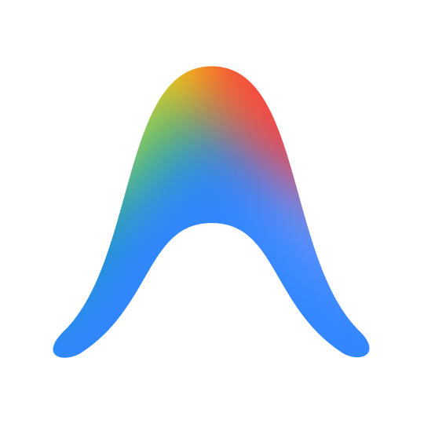
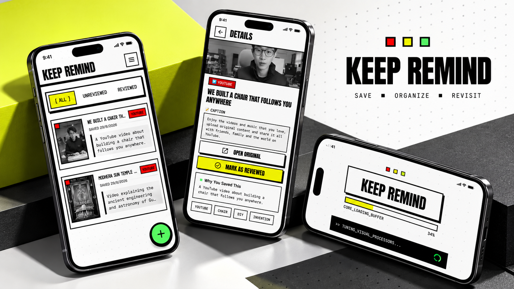

<div align="center">

# 👋 Hey, I'm Rohit Ojha

### 💻 Flutter Developer • Mobile Developer • Software Developer


<p>
  <a href="https://github.com/Rohiitt405">
    
  </a>
  <a href="https://linkedin.com/in/rohitojha405">
    
  </a>
  <a href="https://leetcode.com/u/rohiitt/">
    
  </a>
</p>


</div>

---

# 🧑‍💻 About Me

I'm a developer who enjoys **building things, solving problems, and learning by doing**.

My main focus is **Flutter and mobile development**. I'm also learning backend development, APIs, databases, cloud services, and software architecture so I can understand more of what goes into building complete applications.

I like taking an idea, turning it into code, debugging it when things break, and eventually getting it into a usable state.

```text
💡 Think
   ↓
🧠 Learn
   ↓
💻 Build
   ↓
🐛 Debug
   ↓
🚀 Ship
   ↓
🔁 Repeat
```

### 🔭 What I'm Working On

* 📱 Improving my Flutter and Dart skills
* 🏗️ Learning better application architecture
* 🔄 Working with Provider and Riverpod
* 🌐 Building and consuming REST APIs
* 🔥 Exploring Firebase and Firestore
* 🗄️ Learning backend development and databases
* 🧠 Practicing DSA and problem solving
* 🚀 Building projects to improve my development skills

---

# 🛠️ Tech Stack

## 💻 Languages

<p>
  
</p>

## 📱 Mobile Development

<p>
  
</p>

`Flutter` · `Dart` · `Android` · `Provider` · `Riverpod`

## 🌐 Web & Backend

<p>
  
</p>

`Node.js` · `Express.js` · `REST APIs` · `MongoDB`

## ☁️ Cloud & Services

<p>
  
</p>

`Firebase` · `Firestore` · `Firebase Storage`

## 🔧 Tools

<p>
  
  
</p>

---

# 🚀 Featured Projects

## 🧠 KeepRemind

<p align="center">
  
</p>

### 💡 What is it?

I built **KeepRemind** to solve a simple problem: we save interesting links all the time, but often forget why we saved them or never come back to them.

KeepRemind lets you save links from platforms like YouTube, Instagram, Reddit, TikTok and the web, then organize them with **AI-generated notes, tags, and reminders**.

### 🛠️ Built With

`Flutter` · `Dart` · `Firebase` · `Firestore` · `Firebase Storage` · `Gemini AI` · `Provider` · `SharedPreferences`

### ✨ Features

* 🔗 Save links through the Android Share Sheet
* 🤖 Generate memory notes and tags with AI
* ⏰ Set reminders to revisit saved links
* ☁️ Firebase authentication and cloud sync
* 🔄 Backup and restore saved data
* ⚡ Background AI processing with retry handling
* 🎨 Material 3 UI

<p align="center">
  <a href="https://github.com/Rohiitt405/KeepRemind">
    
  </a>
  <a href="https://github.com/Rohiitt405/KeepRemind/releases/latest">
    
  </a>
</p>

---

## ✅ TaskFlow

<p align="center">
  
</p>

### 💡 What is it?

**TaskFlow** is a simple offline-first task manager built with Flutter.

The goal was to keep task management straightforward while still adding a few useful features, including **OCR-based task creation**.

You can create tasks manually or extract text from an image and turn it into a task.

### 🛠️ Built With

`Flutter` · `Dart` · `SharedPreferences` · `Google ML Kit` · `ImagePicker` · `Audioplayers` · `Material 3`

### ✨ Features

* 📝 Create, edit and complete tasks
* 🔍 Search tasks instantly
* 💾 Store tasks locally for offline use
* 📸 Create tasks from images using OCR
* 🤖 Google ML Kit Text Recognition
* 🔊 Audio feedback for supported actions
* 👆 Swipe to delete tasks
* 🎨 Material 3 interface

<p align="center">
  <a href="https://github.com/Rohiitt405/TaskFlow">
    
  </a>
  <a href="https://github.com/Rohiitt405/TaskFlow/releases/latest">
    
  </a>
</p>

---

# 📊 GitHub Activity

<div align="center">


</div>

---

# 🐍 Contribution Snake

<p align="center">
  
</p>

---

# 🏆 Achievements & Certifications

| 🏆 Achievement                     | 📌 Details                   |
| ---------------------------------- | ---------------------------- |
| 🧩 **LeetCode**                    | 228+ Problems Solved         |
| 🔥 **GeeksforGeeks**               | 160 Days of Coding Challenge |
| 💻 **Newton School of Technology** | C++ Beginner Certification   |
| 🔧 **GeeksforGeeks**               | Git & GitHub Certification   |

---

# 📚 Currently Learning

I'm currently focused on becoming a stronger **Flutter developer** while building a better understanding of backend development.

### 🎯 Learning Goals

* 📱 Advanced Flutter & Dart
* 🏗️ Clean and maintainable architecture
* 🔄 Provider & Riverpod
* 🌐 REST API integration
* 🔥 Firebase
* 🗄️ Backend development and databases
* 🎨 Responsive UI development
* ⚡ Performance optimization
* 🧪 Testing and debugging
* 🚀 App deployment

---

# 💡 What I Like Building

```text
📱 Mobile Apps
      +
🌐 Backend Services
      +
🔥 Cloud Technologies
      +
🤖 AI Features
      +
🧠 Problem Solving
      ↓
   🚀 Projects
```

I enjoy working on projects where **mobile development, APIs, cloud services, AI, and real-world problems** come together.

---

# 🎯 Goals

* [ ] 🚀 Build more production-ready Flutter applications
* [ ] 📱 Get better at advanced Flutter and Dart
* [ ] 🏗️ Improve my understanding of software architecture
* [ ] 🔥 Build more Firebase-powered applications
* [ ] 🤖 Experiment with AI features in mobile apps
* [ ] 🧠 Solve more DSA problems
* [ ] 🌐 Improve my backend development skills
* [ ] 🤝 Contribute to open-source projects
* [ ] 📦 Publish more applications
* [ ] 🚀 Build software used by real users

---

# 🤝 Let's Connect

<div align="center">

  <a href="https://github.com/Rohiitt405">
     
  </a>

  <a href="https://linkedin.com/in/rohitojha405">
    
  </a>

  <a href="https://leetcode.com/u/rohiitt/">
    
  </a>

  <a href="mailto:rohiitt405@gmail.com">
    
  </a>

</div>

---

<div align="center">

### 💭

*"The best way to learn is to build."*


</div>
